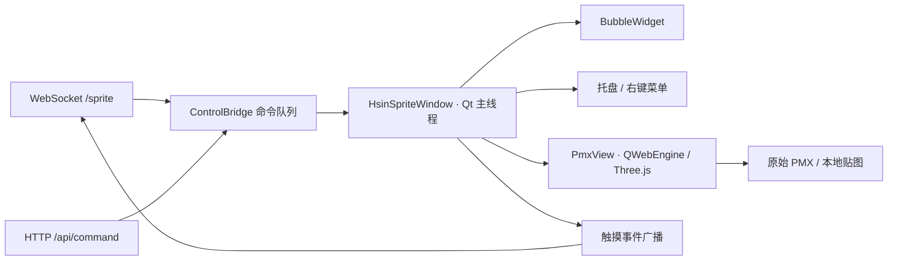

# 迁移与渲染接入口

参考本机 aemeath-spirit 提交 `f6c5f6c5812add4415c2f4659f2723f4c7105871`，本项目在迁移后可独立运行。

| 功能 | 复用方式 |
| --- | --- |
| 透明背景 | 从 `sprite_window.py` 原样提取 `BackgroundFrame` 类 |
| 气泡 | 迁移 `BubbleWidget`，调整配色、纯文本显示、单次隐藏定时与屏幕边缘定位 |
| 桌面窗口 | 适配原窗口标志、QStackedLayout、置顶和原生穿透处理 |
| 托盘 | 复用独立顶层菜单与共享 QAction，提供穿透恢复和退出入口 |
| 拖动 | 保留全局鼠标坐标减窗口偏移的逻辑，补充画板事件转发与拖动/点击区分 |
| 本地控制 | 保留 WebSocket JSON 包络、响应名称与 HTTP 控制路由，统一 Qt 主线程命令执行 |

源文件 SHA-256 和复用范围记录在 `reference-provenance.json`。未发现参考项目根目录的独立许可证文件，本文只记录实际本地迁移来源，不推定其对外发布许可。

`ControlServices` 在一个后台 asyncio 线程里运行 WebSocket 与 aiohttp。`ControlBridge` 通过 Qt 排队信号把窗口控制和状态读取交给主线程，使用 Future 返回实际执行结果。退出时先取消待处理请求，再关闭接口并释放端口，最后清理窗口与启动锁。

默认 `PmxView` 用透明 QWebEngine 页面和本地 Three.js r165/MMDLoader 直接读取原 PMX。QWebChannel 报告渲染页面准备状态、模型成功或错误；完整贴图加载与实际绘制后才设置 `model_loaded=true`。鼠标由外层 Qt 控件接收，保留窗口拖动和点击广播。

`SpriteView` 保留为显式 `renderer: placeholder` 的框架验证入口。实际 PMX 已验证双形态、基础表情、透明合成、动作和 Ammo/Bullet 物理。Qt 精确计时器推进网页动画帧，前一帧未完成时跳过新帧，防止物理较慢时堆积命令；隐藏时暂停，显示时恢复。口型、视线和中日 TTS 已接入；SDEF 精确变形仍未实现。详细来源和边界见 `PMX.md`、`ANIMATION.md`。
